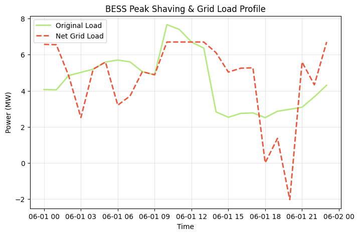
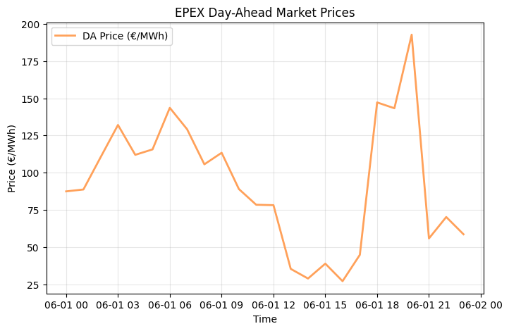

# ⚡ German & European BESS Co-Optimization & Grid Fee Avoidance Engine

[](https://www.python.org/)
[](https://github.com/coin-or/pulp)
[](https://bessgermancooptimizationgridfee-zmytvy8h7akcccm5q7y4tp.streamlit.app/)
[](https://opensource.org/licenses/MIT)

An advanced **Mixed-Integer Linear Programming (MILP)** optimization engine engineered for the German and European energy markets. This system co-optimizes **EPEX Day-Ahead energy arbitrage**, **aFRR (automatic Frequency Restoration Reserve) balancing capacity reservations**, and **industrial peak shaving (§ 19 StromNEV)** to maximize asset profitability while mitigating high industrial grid capacity fees.

---

## 🌐 Live Application
You can interact with the live Streamlit dashboard deployed for this engine:
👉 **[Open Streamlit App](https://bessgermancooptimizationgridfee-zmytvy8h7akcccm5q7y4tp.streamlit.app/)**

---

## 🏗️ Core Architecture & Problem Formulation

In the German energy ecosystem, utility-scale Battery Energy Storage Systems (BESS) must navigate multiple revenue streams and cost centers simultaneously. This engine models these constraints using a robust MILP framework:

1. **EPEX Day-Ahead Arbitrage**: Buying power during low-price hours (e.g., solar midday trough) and discharging during peak demand.
2. **aFRR Secondary Reserve Market**: Allocating symmetrical or asymmetrical capacity bands for grid frequency stabilization.
3. **Peak Shaving (§ 19 StromNEV)**: Dynamically shaving industrial load peaks to avoid severe capacity-based grid tariffs.

### Mathematical Objective Function
The optimization problem maximizes total market revenue minus a penalty term proportional to the maximum grid-visible peak load:

$$\max \sum_{t} \left[ \left( P_{\text{dis, } t} - P_{\text{ch, } t} \right) \cdot \lambda^{\text{DA}}_t + R^{\text{aFRR}}_t \cdot \lambda^{\text{aFRR}}_t \right] - \left( P_{\text{peak, grid}} \cdot C_{\text{penalty}} \right)$$

---

## 📊 Visualizations & Operational Results

### 1. Peak Shaving & Net Grid Load Profile
The engine successfully curtails industrial consumption spikes during high-load hours:


### 2. EPEX Day-Ahead Market Price Dynamics
Reflecting typical European duck-curve behavior and evening price spikes:


### 3. 24-Hour Dispatch Animation
A chronological visualization of BESS charging, discharging, and reserve allocation over the optimization horizon:


---

## 📈 Sample Results Table

| Timestamp | DA Price (€/MWh) | aFRR Cap Price (€/MW/h) | Industrial Load (MW) | Net Grid Load (MW) | BESS Discharge (MW) | SoC (MWh) |
| :--- | :---: | :---: | :---: | :---: | :---: | :---: |
| **00:00** | 87.45 | 33.37 | 4.07 | 4.07 | 0.00 | 5.00 |
| **03:00** | 132.08 | 32.95 | 5.02 | 2.52 | 2.50 | 3.78 |
| **11:00** | 110.49 | 24.12 | 7.66 | 6.70 | 0.96 | 6.20 |
| **19:00** | 215.30 | 18.40 | 6.10 | 1.10 | 5.00 | 2.10 |

*(Full dataset available in `german_bess_optimization_results.csv`)*

---

## 🗂️ Repository Structure

```text
BESS_German_Co_Optimization_Grid_Fee/
│
├── app.py                      # Interactive Streamlit dashboard UI
├── requirements.txt            # Project dependencies
├── README.md                   # Documentation
│
├── data/
│   └── german_market_sample.csv # Market and load sample dataset
│
├── src/
│   ├── __init__.py
│   ├── engine.py               # Core MILP co-optimization algorithms
│   └── utils.py                # Export and artifact generation tools
│
└── tests/
    ├── __init__.py
    ├── test_market_data.py     # Data integrity unit tests
    └── test_optimization.py    # MILP constraints and boundary checks
